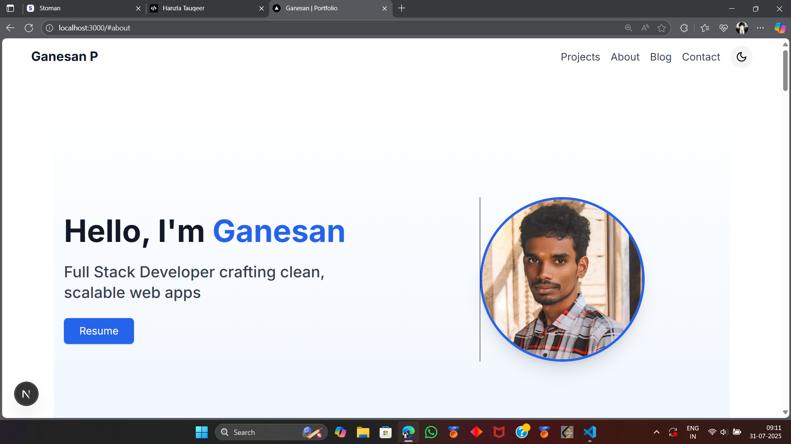
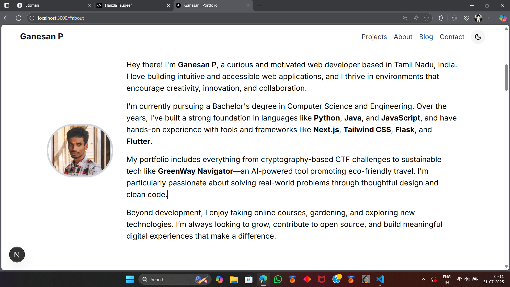
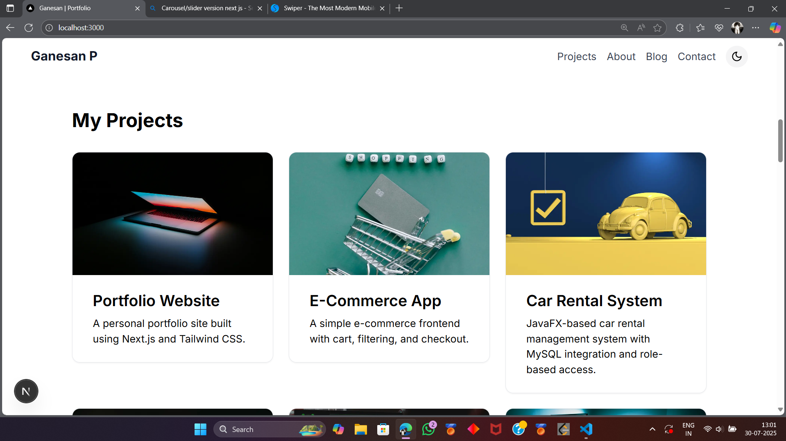
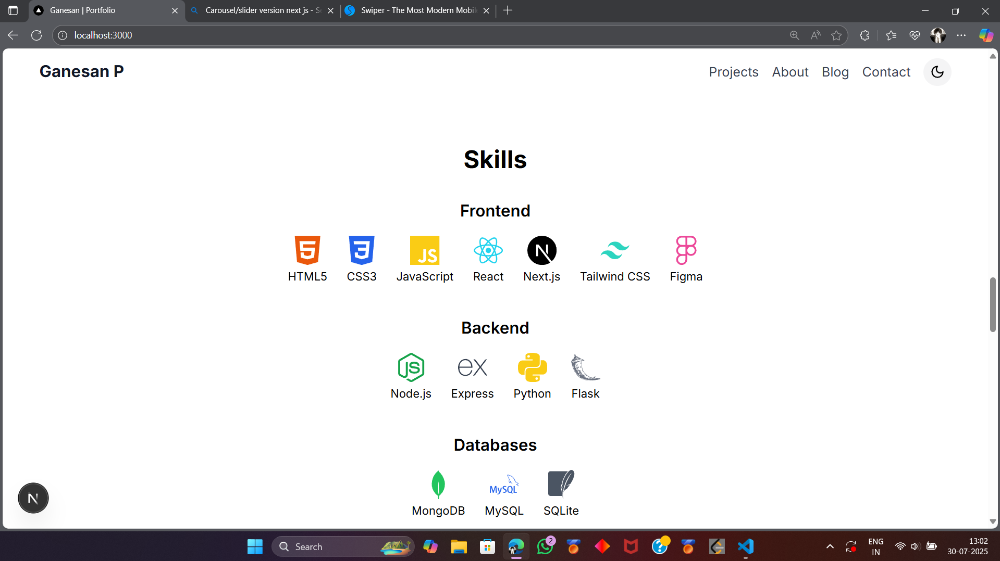
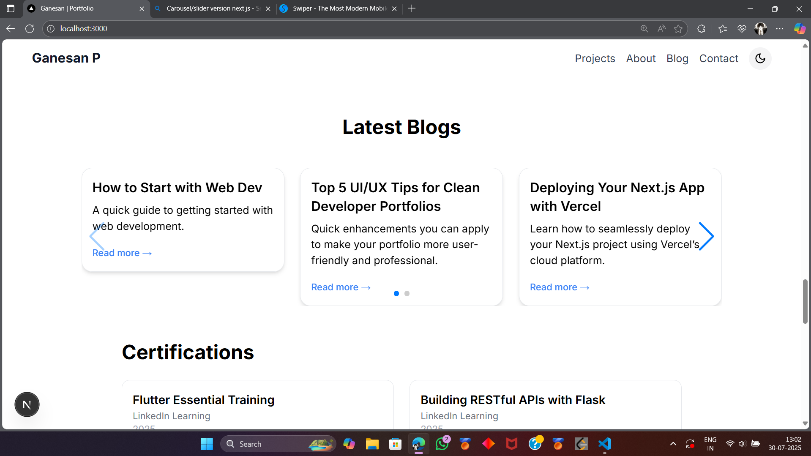

# 🚀 Personal Portfolio Website – Ganesan P

A modern, responsive, and elegant personal portfolio built using **Next.js** and **Tailwind CSS v3**.
It showcases my projects, blogs, and certifications with smooth navigation, dark mode support, and an interactive UI/UX.

---

## 📌 Features

* ⚡ **Responsive Design** – Optimized for mobile, tablet, and desktop.
* 🌙 **Dark Mode Toggle** – Seamless switch between light and dark themes.
* 🧩 **Project Section** – Highlights major personal & academic projects.
* 📝 **Blog Carousel** – Clean slider to browse recent blogs, with full detail pages.
* 📜 **Certifications Page** – Organized display of my certifications.
* 💨 **Smooth Scrolling** – For a clean user experience across sections.
* 🔍 **SEO Friendly** – Structured pages with optimized metadata.
* 📬 **Contact Form** – Fully functional contact form powered by Formspree.

---

## 🧑‍💻 Tech Stack

| Technology          | Description                                                                                 |
| ------------------- | ------------------------------------------------------------------------------------------- |
| **Next.js**         | A React-based framework for server-side rendering, routing, and static site generation.     |
| **TypeScript**      | Ensures type safety and clean, scalable code architecture.                                  |
| **Tailwind CSS v3** | A utility-first CSS framework used for rapid and consistent UI development.                 |
| **Swiper.js**       | Used for creating a sleek and responsive blog carousel/slider.                              |
| **Framer Motion**   | Used to create smooth, interactive animations in web applications, particularly with React. |
| **React Icons**     | Easily integrate vector icons in React components.                                          |
| **Formspree**       | Used for handling form submissions securely without a custom backend.                       |

---

## 📁 Folder Structure (simplified)

```
/app
├── page.tsx              # Home page
├── /blog
│   ├── [id]/page.tsx     # Dynamic blog detail page
│   └── page.tsx          # Blog list page with carousel
├── /certifications
│   └── page.tsx          # Certifications listing page
├── /projects
│   └── page.tsx          # Projects page

/components
├── Navbar.tsx
├── Footer.tsx
├── BlogCard.tsx
├── BlogCarousel.tsx
├── ProjectCard.tsx
├── ThemeToggle.tsx
└── ContactForm.tsx

/data
├── blogData.ts
├── projectData.ts
└── certificationsData.ts

/public
└── (assets like images, icons)

/styles
└── globals.css
```

---

## 🖼️ Screenshots

 

 

 

 

 

 

 


---

## 🚀 Getting Started (Local Development)

1. **Clone the repository**

```bash
git clone https://github.com/your-username/portfolio.git
cd portfolio
```

2. **Install dependencies**

```bash
npm install
# or
yarn install
```

3. **Run the dev server**

```bash
npm run dev
```

---

## 🌐 Deployment

The website is live at: [https://your-deployment-link.com](https://your-deployment-link.com)

## 👨‍🎓 Author

**Ganesan P**
Final Year Computer Science Student
📫 [LinkedIn](#) • Email
